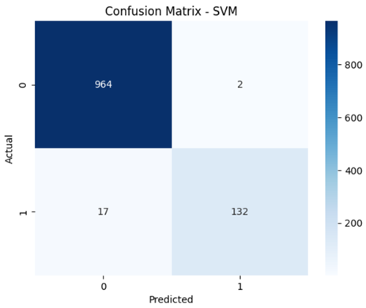

# Experimental Results

The three machine learning models were evaluated using the same dataset split and TF-IDF representation.

## Model Comparison

| Model | Accuracy | Precision | Recall | F1-Score | False Positives | False Negatives |
| :--- | :---: | :---: | :---: | :---: | :---: | :---: |
| **Multinomial Naïve Bayes** | 97.40% | 100.00% | 81.00% | 89.00% | 0 | 29 |
| **Logistic Regression** | 96.70% | 100.00% | 75.00% | 86.00% | 0 | 37 |
| **Linear SVM** | **98.30%** | **99.00%** | **89.00%** | **93.00%** | **2** | **17** |

## Final Model

The final model used in the Streamlit prototype was **Linear SVM**.

The selection was based on the experimental comparison of the evaluated models, where Linear SVM achieved the overall best balance across Accuracy (98.30%), Spam Recall (89.00%), and Spam F1-Score (93.00%).

## Class Imbalance Experiment

A balanced SVM configuration was also tested.

The balanced configuration improved spam recall but increased the number of legitimate messages classified as spam. This illustrates the trade-off between detecting more spam and generating false positives.

## Visualizations

### Confusion Matrix

### Model Comparison Figure

